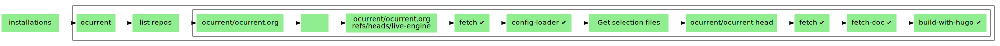

# OCurrent.org

[OCurrent.org](https://github.com/ocurrent) is the town hall for all `OCurrent` related stuffs.

:warning: This is currently on heavy development and as a result not stable at all!

## Pipeline 

The `OCurrent.org` website is able to rebuild itself if the documentation change in the various repositories it tracks. This is achieved by running an ocurrent pipeline:



## Development

### Dependencies

To be able to develop with OCurrent, you need to have the following tools installed on your system:
 - `opam` (>= `2.0`)
 - `hugo` (>= `0.100`)

To install `hugo`, you can follow these instructions on the [gohugo.io website](https://gohugo.io/getting-started/installing/).

### Run a development server

To run a development server, you can run this command and go to [localhost:1313](http://localhost:1313)
to see the result:
 ```
 hugo server -v
 ```
 
 To build the page as a static website, you can execute this command the website will be built into `./public`:
```
hugo --minify -d "./public"
```

### Deployement - Pipeline

#### Step 1

To run the pipeline, you need to create a `GitHub App` with the following permissions:
```
Content: Read-Only
Meta-data: Read-Only
```
and subscribe to the event `Push`. You also have to add a pointer to the `/webhooks/github` entry point. This repository will be the base of the website that is going to be built.
In the `Wehooks` section, insert the following parameters:
- Payload URL: _url-of-your-pipeline-entry-point/webhooks/github_
- Secret: choose a random character string for it

You need to generate a `private key` for the client and store it somewhere. Finally, the application needs to be installed in the repository where the configuration (`tracker.yml`) is stored.

#### Step 2

You need to have an ssh key on the server where the pipeline is deployed. Otherwise, you can create one by followning [this tutorial](https://docs.github.com/en/authentication/connecting-to-github-with-ssh/generating-a-new-ssh-key-and-adding-it-to-the-ssh-agent).
Then you should go to the repository where your code will be pushed and add a deploy key (an ssh key only related to this repository). To do so, go to `https://github.com/USER/REPO/settings/keys`.

Now, we are ready to run our pipeline.

#### Step 3

Clone this repository, and install opam dependencies (we assume that you have `hugo` and, `opam`):
```sh
git clone https://github.com/ocurrent/ocurrent.org.git
opam switch create . --deps-only
eval $(opam env)
```

Ensure you have your secret in a file (`secret-file`) and your key (`key.pem`) too and run:
```
dune exec -- bin/main.exe --github-account-allowlist="<USER>" \
                          --github-app-id="<ID>" \
                          --github-private-key-file="key.pem" \
                          --github-webhook-secret-file="secret-file" \
                          --branch="master" \
                          -v
```

And, tada, the pipeline is now live :v:

### Deployement - Config format

As mentionned above, you need to have a file named `tracker.yml` in the repository you add to the command line so it is able to konw what to do with it. Here is an example of such a file:
```yaml
output:
  owner: "ocurrent"
  name: "ocurrent.github.io"
  branch: "main"
repos:  
  - owner: "ocurrent"
    name: "ocurrent"
    files:
      - title: "Index"
        summary: "Main file for the repo"
        src: "doc/index.md"
        dst: "content/docs/ocurrent/ocurrent.md"
        authors:
          - "John Doe"
      - title: "Disk cache"
        summary: "About the disk cache"
        src: "doc/disk_cache.md"
        dst: "content/docs/ocurrent/doc.md"
        authors:
          - "Jane Smith"
          - "Robert Hammer"
  - owner: "ocurrent"
    name: "ocaml-ci"
    files:
      - title: "Local_dev"
        summary: "Local dev"
        src: "doc/dev.md"
        dst: "content/docs/ocurrent/local.md"
        authors:
          - "Mary Bonnie"
indexes:
  - title: "OCurrent Index"
    description: "List of ocurrent documentation"
    dst: "content/docs/ocurrent/"
```

It's splitted in three sections: `output`, `repos` and, `indexes`. `output` is the description of the repository where you are going to commit in. The branch on which it will be pushed should already exist. `repos` is a reference to the _repositories_ you are tracking and the files you want to track into it. `indexes` is the `_index.md` creator for hugo so we can split collections with hugo.

#### Output

```yaml
output:
  owner: "USER"
  name: "REPO"
  branch: "BRANCH"
```

#### Files

```yaml
repos:
  - owner: "USER"
    name: "REPO"
    files:
      - title: "Title displayed on the website"
        summary: "The brief explanation about what it is"
        src: "relative/path/to/the/file/from/user/repo/root"
        dst: "relative/path/to/the/file/from/output/repo/root"
        authors:
          - "Who writes this?"
```

#### Indexes

```yaml
indexes:
  - title: "Title displayed as a section on the website"
    description: "Brief documentation about it"
    dst: "relative/path/to/the/dir/from/output/repo/root"

```
